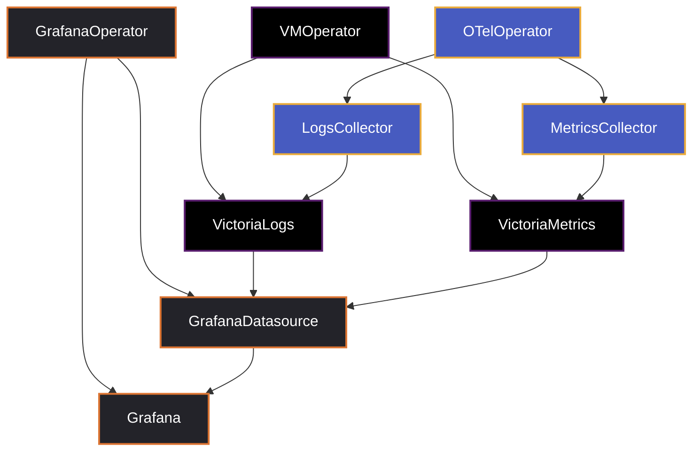

# OTel Playground (Lab)

Spin up a minimal metrics + logs stack on any Kubernetes cluster to experiment with OpenTelemetry collection and
VictoriaMetrics/VictoriaLogs visualization in Grafana.

What you get:

- VictoriaMetrics (metrics) and VictoriaLogs (logs) via the VictoriaMetrics Operator
- OpenTelemetry Operator + a metrics `OpenTelemetryCollector` with Prometheus TargetAllocator
- Grafana Operator provisioning Grafana, datasources, and example dashboards

## Quickstart (any Kubernetes cluster)

Prerequisites:

Server-side apply Prometheus CRDs (too large for client apply)

```shell
kubectl kustomize --enable-helm k8s/prometheus-operator-crds | kubectl apply --server-side -f -
```

Apply the rest

```shell
kubectl kustomize --enable-helm k8s | kubectl apply -f -
```

### Grafana

```shell
kubectl -n monitoring port-forward svc/grafana-service 3000:3000
```

http://localhost:3000 (anonymous admin)

### VictoriaMetrics

```shell
kubectl -n monitoring port-forward svc/vmsingle-victoria-metrics 8428:8428
```

http://localhost:8428

### VictoriaLogs

```shell
kubectl -n monitoring port-forward svc/vlsingle-victoria-logs 9428:9428
```

http://localhost:9428

## How it fits together

High‑level view of the components and connections:

- Grafana Operator installs a Grafana instance with anonymous access and provisions:
    - Datasources for VictoriaMetrics Prometheus API, native metrics, and logs
    - Example dashboards: metrics‑server, promhttp, logs overview
- VictoriaMetrics Operator deploys single‑node VictoriaMetrics and VictoriaLogs
- OpenTelemetry Operator manages an `OpenTelemetryCollector` named `metrics` that:
    - Enables Prometheus TargetAllocator to discover ServiceMonitors/PodMonitors
    - Receives OTLP (gRPC/HTTP) and scrapes Kubernetes/Prometheus targets
    - Exports metrics to VictoriaMetrics via OTLP HTTP
- Prometheus Operator CRDs provide `ServiceMonitor`/`PodMonitor` kinds
- A `ServiceMonitor` for `metrics-server` is included as an example scrape target



## Send your app’s metrics (optional)

Point your app’s OTLP exporter at the in‑cluster collector service:

- gRPC: `metrics-collector.monitoring.svc.cluster.local:4317`
- HTTP: `http://metrics-collector.monitoring.svc.cluster.local:4318`

Within the cluster, the DNS short name also works: `metrics-collector.monitoring.svc:4317`.

## Customize

Edit the manifests below to tweak the lab:

- Grafana instance and operator values: `k8s/grafana/values.yaml`, `k8s/grafana/grafana.yaml`
- Grafana datasources: `k8s/grafana/datasource-vm-*.yaml`
- Grafana dashboards: `k8s/grafana/dashboard-*.yaml`
- OTel Collector (metrics): `k8s/otel/metrics-collector.yaml`, RBAC: `k8s/otel/rbac-metrics-collector.yaml`
- Example scrape target: `k8s/metrics-server/servicemonitor.yaml`
- Kustomize entry point: `k8s/kustomization.yaml`

## Troubleshooting

- CRDs first: If TargetAllocator doesn’t list any scrape jobs, ensure the CRDs were applied before the stack.
- Images: On local clusters that can’t pull images, you may need to pre‑load images. If you use Kind, run:
  ```shell
  ./load.sh
  ```
- Health checks:
  ```shell
  kubectl get pods -n monitoring
  kubectl describe otelcol/metrics -n monitoring | sed -n '1,120p'
  kubectl get grafanadatasources.integreatly.org -n monitoring
  ```
- ServiceMonitor present:
  ```shell
  kubectl get servicemonitors -A | grep metrics-server || true
  ```

## Clean up (optional, Kind)

If you created a temporary Kind cluster for this lab:

```shell
kind create cluster   # to create
kind delete cluster   # to delete
```

## Resources

- https://docs.victoriametrics.com
- https://victoriametrics.com/blog/victorialogs-opentelemetry/
- https://opentelemetry.io
- https://github.com/grafana/grafana-operator
- https://github.com/nickytd/k8s-light-logs
- https://github.com/awsab/opentelemetry-setup
