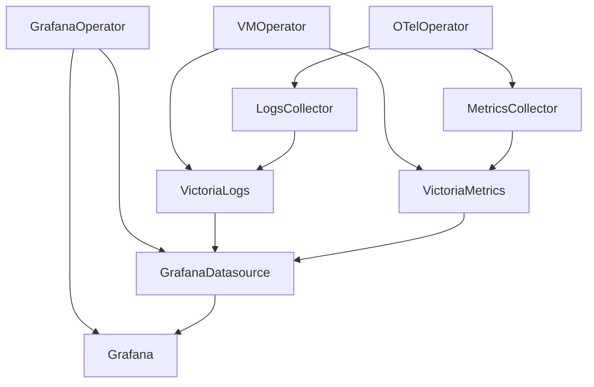

# OTel Playground

Trying to configure an OTel Collector to work with Victoria Metrics and Victoria Logs and visualise the data in
Grafana.

## Create Kind-cluster

```shell
kind create cluster
```

## Apply Everything

```shell
kubectl kustomize --enable-helm --load-restrictor=LoadRestrictionsNone | kubectl apply -f -
```

## Load Images

If Kind struggles to pull images, run

```shell
./load.sh
```

## Grafana

```shell
kubectl -n monitoring port-forward svc/grafana-service 3000:3000
```

## Victoria Logs

```shell
kubectl -n monitoring port-forward svc/vlsingle-victoria-logs 9428:9428
```

## Victoria Metrics

```shell
kubectl -n monitoring port-forward svc/vmsingle-victoria-metrics 8428:8428
```

## Configuration



## Tips & Tricks

### Find the latest chart version

```shell
helm search repo <repo>
```

## Resources

https://github.com/nickytd/k8s-light-logs
https://github.com/awsab/opentelemetry-setup
